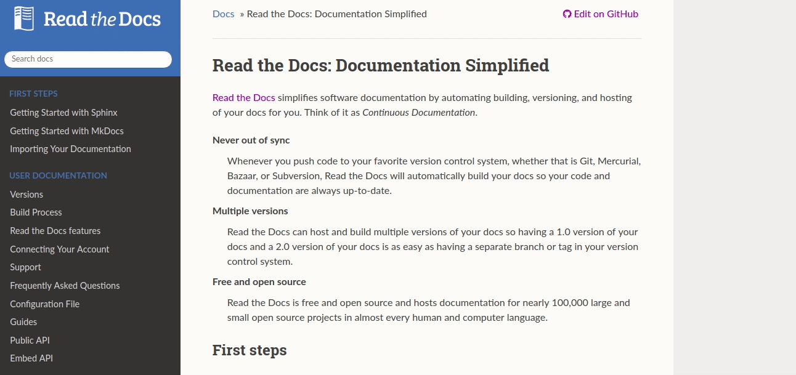

readthedocs-sphinx-search
=========================

``readthedocs-sphinx-search`` is a `Sphinx`_ extension to enable `Read the Docs`_'s
in-doc search UI.

This extension is developed to be used on `Read the Docs`_.

In-Doc Search UI
----------------

Using the existing search backend of `Read the Docs`_,
this extension is designed to greatly improve the search experience
of the reader. This adds the full page search UI to the docs
which supports ``search as you type`` feature.

    Demo

Browser Support
~~~~~~~~~~~~~~~

The JavaScript for this extension is written with new features and syntax,
however, we also want to support older browsers upto IE11.
Therefore, we are using babel to transpile the new and shiny JavaScript code
to support all browsers.

The CSS is also autoprefixed to extend the support to most of the browsers.

.. toctree::
   :maxdepth: 1
   :caption: Contents:

   installation
   custom-design
   testing
   get-involved

.. _Sphinx: https://www.sphinx-doc.org/
.. _Read the Docs: https://readthedocs.org
